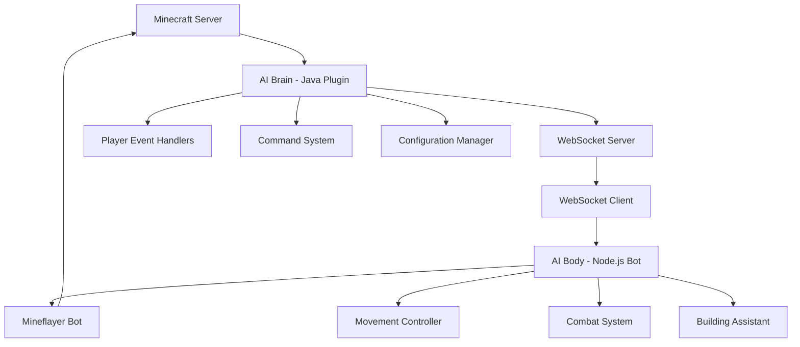

# Minecraft AI Companion Plugin

[](https://github.com/your-repo/minecraft-ai-plugin)
[](https://opensource.org/licenses/MIT)
[](https://openjdk.org/)
[](https://nodejs.org/)

A hybrid architecture Minecraft AI companion plugin that combines a Java-based server plugin with a Node.js Mineflayer bot to create intelligent, interactive AI companions for players.

## 🏗️ Architecture

This project uses a unique hybrid architecture:



### Components

- **AI Brain (Java Plugin)**: Runs on the Minecraft server, handles player interactions, manages AI logic, and communicates with the AI Body
- **AI Body (Node.js Bot)**: Connects to the server as a bot, executes physical actions, and provides the AI companion's presence in the game world
- **WebSocket Communication**: Real-time bidirectional communication between Brain and Body using a custom protocol

## ✨ Features

- **Real-time Player Interaction**: AI companions respond to player actions and commands
- **Intelligent Movement**: Advanced pathfinding and natural movement patterns
- **Combat Assistance**: Companions can fight alongside players and protect them
- **Building Assistant**: Help with construction projects and resource gathering
- **Voice Integration**: Speech-to-text and text-to-speech capabilities (future feature)
- **Customizable Personalities**: Different AI personalities and behaviors
- **Multi-Language Support**: Designed with Korean language optimization

## 🛠️ Requirements

### System Requirements
- **Java**: 17 or higher
- **Node.js**: 18 or higher
- **Minecraft Server**: 1.21+ (Spigot/Paper)
- **Memory**: At least 2GB RAM recommended
- **Network**: Open port for WebSocket communication (default: 8765)

### Dependencies
- Spigot/Paper API 1.21
- Mineflayer 4.x with plugins
- WebSocket libraries (Java-WebSocket, ws)

## 📦 Installation

### 1. Download and Setup

```bash
# Clone the repository
git clone https://github.com/your-repo/minecraft-ai-plugin.git
cd minecraft-ai-plugin
```

### 2. Build and Install Java Plugin (AI Brain)

```bash
# Navigate to the Java plugin directory
cd minecraft-ai-brain

# Build the plugin
./gradlew build

# Copy the built plugin to your Minecraft server
cp build/libs/minecraft-ai-brain-*.jar /path/to/your/minecraft/server/plugins/
```

### 3. Setup Node.js Bot (AI Body)

```bash
# Navigate to the Node.js bot directory
cd minecraft-ai-body

# Install dependencies
npm install

# Create environment configuration
cp .env.example .env

# Edit the .env file with your server details
# MINECRAFT_HOST=localhost
# MINECRAFT_PORT=25565
# MINECRAFT_USERNAME=AICompanion
# WEBSOCKET_HOST=localhost
# WEBSOCKET_PORT=8765
```

### 4. Configure the Plugin

Edit the plugin configuration file at `plugins/minecraft-ai-brain/config.yml`:

```yaml
# WebSocket Configuration
websocket:
  port: 8765
  host: "localhost"
  
# AI Configuration
ai:
  default_personality: "friendly"
  response_timeout: 10000
  
# Bot Configuration
bot:
  username: "AICompanion"
  auto_reconnect: true
  max_reconnect_attempts: 5
```

## 🚀 Usage

### Starting the System

1. **Start your Minecraft server** with the AI Brain plugin installed
2. **Launch the AI Body bot**:
   ```bash
   cd minecraft-ai-body
   npm start
   ```

### Basic Commands

- `/ai summon` - Summon an AI companion
- `/ai follow` - Make the AI companion follow you
- `/ai stop` - Stop the AI companion's current action
- `/ai config` - Access configuration settings
- `/ai status` - Check AI companion status

### Example Interactions

```
Player: /ai summon
AI Companion joins the game and approaches the player

Player: /ai follow
AI Companion: "I'll follow you!"
AI Companion starts following the player

Player: Chat: "Help me build a house"
AI Companion: "I'd be happy to help! What materials do you need?"
AI Companion starts gathering nearby wood and stone
```

## 🔧 Configuration

### Environment Variables

Create a `.env` file in the `minecraft-ai-body` directory:

```env
# Minecraft Server Connection
MINECRAFT_HOST=localhost
MINECRAFT_PORT=25565
MINECRAFT_USERNAME=AICompanion

# WebSocket Configuration
WEBSOCKET_HOST=localhost
WEBSOCKET_PORT=8765

# AI Configuration (Optional)
OPENAI_API_KEY=your_openai_api_key_here
GOOGLE_CLOUD_CREDENTIALS=path/to/credentials.json
```

### Plugin Configuration

The Java plugin configuration is located at `plugins/minecraft-ai-brain/config.yml`:

```yaml
# WebSocket Configuration
websocket:
  port: 8765
  host: "localhost"
  enabled: true

# AI Companion Settings
companion:
  default_name: "AICompanion"
  max_companions: 5
  auto_spawn: true
  
# Features
features:
  combat_assistance: true
  building_assistant: true
  voice_integration: false
  
# Logging
logging:
  level: "INFO"
  log_websocket_messages: false
```

## 🏗️ Development

### Development Setup

1. **Setup Development Environment**:
   ```bash
   # Install Java 17+
   # Install Node.js 18+
   # Install your preferred IDE
   ```

2. **Build Development Versions**:
   ```bash
   # Build Java plugin in development mode
   cd minecraft-ai-brain
   ./gradlew build -x test
   
   # Install Node.js dependencies
   cd minecraft-ai-body
   npm install
   npm run build
   ```

3. **Run in Development Mode**:
   ```bash
   # Start the Node.js bot in development mode
   cd minecraft-ai-body
   npm run dev
   ```

### Project Structure

```
minecraft-ai-plugin/
├── minecraft-ai-brain/          # Java Plugin (AI Brain)
│   ├── src/main/java/           # Java source code
│   ├── src/main/resources/      # Plugin resources
│   └── build.gradle             # Build configuration
├── minecraft-ai-body/           # Node.js Bot (AI Body)
│   ├── src/                     # TypeScript source code
│   ├── dist/                    # Compiled JavaScript
│   └── package.json             # Node.js dependencies
├── protocol/                    # Shared protocol definitions
│   ├── schemas/                 # JSON schemas
│   └── docs/                    # Protocol documentation
└── docs/                        # Project documentation
```

## 🤝 Contributing

1. Fork the repository
2. Create a feature branch (`git checkout -b feature/amazing-feature`)
3. Commit your changes (`git commit -m 'Add some amazing feature'`)
4. Push to the branch (`git push origin feature/amazing-feature`)
5. Open a Pull Request

Please read [CONTRIBUTING.md](docs/CONTRIBUTING.md) for details on our code of conduct and development process.

## 📖 Documentation

- [Architecture Overview](docs/ARCHITECTURE.md)
- [Development Guide](docs/DEVELOPMENT.md)
- [Deployment Guide](docs/DEPLOYMENT.md)
- [API Reference](docs/API.md)
- [Protocol Specification](protocol/docs/protocol-specification.md)

## 🐛 Troubleshooting

### Common Issues

1. **WebSocket Connection Failed**
   - Check that the port (default: 8765) is not blocked by firewall
   - Verify the host and port settings in both configurations
   - Ensure the Java plugin started successfully

2. **Bot Cannot Connect to Server**
   - Verify Minecraft server is running and accepting connections
   - Check the server's `server.properties` for `online-mode` setting
   - Ensure the bot username doesn't conflict with existing players

3. **Plugin Not Loading**
   - Check server logs for error messages
   - Verify Java version compatibility (17+)
   - Ensure all dependencies are correctly installed

### Debug Mode

Enable debug logging by setting `logging.level: "DEBUG"` in the plugin configuration.

## 📄 License

This project is licensed under the MIT License - see the [LICENSE](LICENSE) file for details.

## 🙏 Acknowledgments

- [Mineflayer](https://github.com/PrismarineJS/mineflayer) - The Node.js Minecraft bot framework
- [Spigot/Paper](https://papermc.io/) - The Minecraft server platform
- [WebSocket Libraries](https://github.com/TooTallNate/Java-WebSocket) - For real-time communication

## 📞 Support

- **Issues**: [GitHub Issues](https://github.com/your-repo/minecraft-ai-plugin/issues)
- **Discussions**: [GitHub Discussions](https://github.com/your-repo/minecraft-ai-plugin/discussions)
- **Documentation**: [Project Wiki](https://github.com/your-repo/minecraft-ai-plugin/wiki)

---

**Note**: This project is under active development. Features and APIs may change. Please check the [changelog](CHANGELOG.md) for updates.
