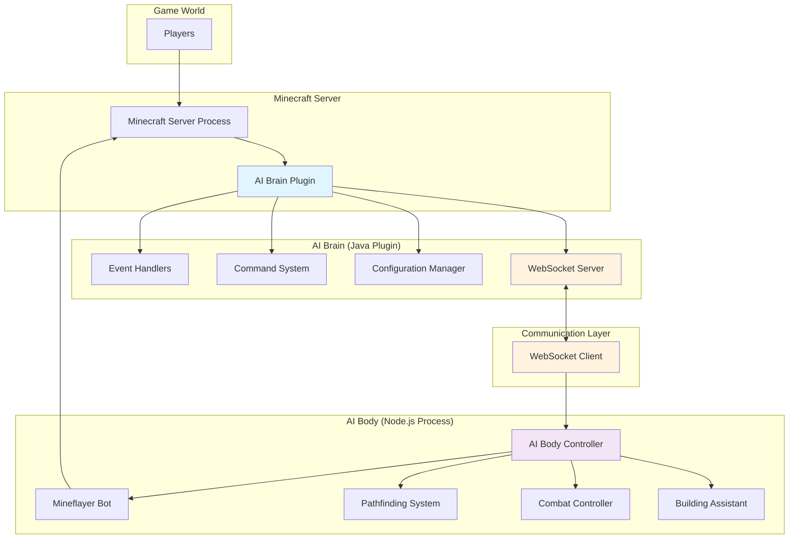
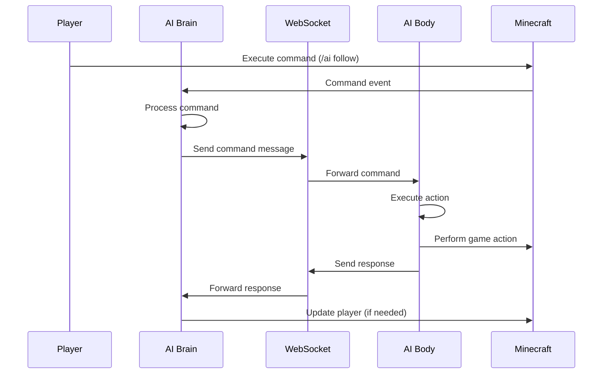
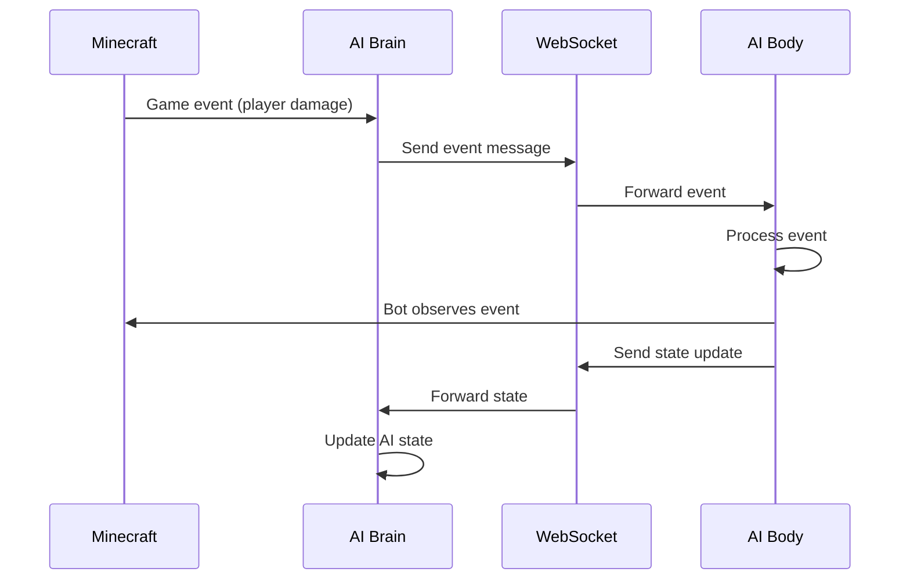

# Minecraft AI Companion - Architecture Overview

## Table of Contents
- [System Overview](#system-overview)
- [Hybrid Architecture](#hybrid-architecture)
- [Component Design](#component-design)
- [Communication Protocol](#communication-protocol)
- [Data Flow](#data-flow)
- [Scalability Considerations](#scalability-considerations)
- [Security Architecture](#security-architecture)

## System Overview

The Minecraft AI Companion uses a unique **hybrid architecture** that separates the AI logic (Brain) from the physical game presence (Body). This design allows for:

- **Distributed Processing**: AI logic runs server-side while bot actions execute client-side
- **Scalability**: Multiple bots can connect to a single AI brain
- **Fault Tolerance**: Components can fail and recover independently
- **Modularity**: Easy to extend and maintain individual components

## Hybrid Architecture



## Component Design

### AI Brain (Java Plugin)

The **AI Brain** is a Spigot/Paper plugin that runs on the Minecraft server and handles:

#### Core Components

1. **MinecraftAIBrainPlugin** (Main Class)
   - Plugin lifecycle management
   - Component initialization
   - Configuration loading

2. **Event Handlers** (`com.minecraft.ai.brain.handlers`)
   - `PlayerEventHandler`: Monitors player actions and interactions
   - `CommandHandler`: Processes player commands
   - Bukkit event listeners for game state changes

3. **WebSocket Server** (`com.minecraft.ai.brain.websocket`)
   - `WebSocketServerManager`: Manages client connections
   - Message serialization/deserialization
   - Connection health monitoring

4. **Utilities** (`com.minecraft.ai.brain.utils`)
   - `ConfigManager`: Configuration file management
   - `Logger`: Centralized logging system

#### Responsibilities

- **Player Interaction Management**: Track player actions, commands, and state
- **AI Decision Making**: Process game context and make strategic decisions
- **Command Dispatch**: Send commands to AI Body for execution
- **Event Processing**: React to game events and update AI state
- **Configuration Management**: Handle plugin settings and parameters

### AI Body (Node.js Application)

The **AI Body** is a Node.js application using Mineflayer that provides the physical presence in the game:

#### Core Components

1. **MinecraftAIBody** (Main Class)
   - Bot lifecycle management
   - WebSocket client connection
   - Plugin coordination

2. **Movement System**
   - Pathfinding integration (mineflayer-pathfinder)
   - Natural movement patterns
   - Obstacle avoidance

3. **Combat System**
   - PvP integration (mineflayer-pvp)
   - Threat assessment
   - Combat tactics

4. **Building System**
   - Construction automation (mineflayer-builder)
   - Resource management
   - Blueprint following

#### Responsibilities

- **Physical Actions**: Execute movement, combat, and building actions
- **World Interaction**: Interact with blocks, entities, and items
- **State Reporting**: Send game state updates to AI Brain
- **Autonomous Behavior**: Handle immediate reactions and reflexes
- **Resource Management**: Manage inventory and equipment

## Communication Protocol

The system uses a **WebSocket-based protocol** for real-time communication between Brain and Body.

### Message Types

1. **Command Messages** (Brain → Body)
   ```json
   {
     "type": "command",
     "id": "uuid",
     "timestamp": "ISO-8601",
     "payload": {
       "action": "moveTo|attack|build|...",
       "parameters": { ... }
     }
   }
   ```

2. **Response Messages** (Body → Brain)
   ```json
   {
     "type": "response",
     "correlationId": "command-uuid",
     "payload": {
       "success": true,
       "result": { ... }
     }
   }
   ```

3. **Event Messages** (Bidirectional)
   ```json
   {
     "type": "event",
     "payload": {
       "eventType": "playerJoined|damageReceived|...",
       "data": { ... }
     }
   }
   ```

4. **State Messages** (Bidirectional)
   ```json
   {
     "type": "state",
     "payload": {
       "stateType": "botStatus|worldStatus|...",
       "data": { ... }
     }
   }
   ```

### Connection Management

- **Handshake Process**: Protocol version negotiation
- **Heartbeat Mechanism**: 30-second intervals with 60-second timeout
- **Reconnection Logic**: Exponential backoff with message queuing
- **Message Ordering**: Sequence numbers for critical operations

## Data Flow

### Player Command Flow



### Event Propagation Flow



## Scalability Considerations

### Horizontal Scaling

1. **Multiple Bots per Brain**
   - Single Brain can manage multiple Body instances
   - Load balancing based on bot capabilities
   - Shared state management

2. **Brain Clustering** (Future)
   - Multiple Brain instances for high player counts
   - Distributed AI decision making
   - Cross-instance communication

### Performance Optimization

1. **Message Batching**
   - Group related commands for efficiency
   - Reduce WebSocket overhead
   - Priority-based message queuing

2. **State Caching**
   - Cache frequently accessed game state
   - Lazy loading of complex data
   - Efficient state synchronization

3. **Resource Management**
   - Connection pooling for WebSocket
   - Memory management for large worlds
   - CPU optimization for pathfinding

## Security Architecture

### Authentication & Authorization

1. **Connection Security**
   - WebSocket connection authentication
   - API key validation
   - IP whitelisting support

2. **Command Validation**
   - Input sanitization for all commands
   - Permission checking
   - Rate limiting protection

3. **Data Protection**
   - Encrypted configuration storage
   - Secure API key management
   - Audit logging for security events

### Threat Mitigation

1. **Denial of Service Protection**
   - Connection rate limiting
   - Message size restrictions
   - Resource usage monitoring

2. **Input Validation**
   - Schema validation for all messages
   - Bounds checking for coordinates
   - Command parameter validation

3. **Isolation**
   - Sandboxed bot execution
   - Restricted file system access
   - Network isolation where possible

## Extension Points

### Plugin Architecture

1. **AI Brain Extensions**
   - Custom event handlers
   - Additional command processors
   - Third-party AI integrations

2. **AI Body Extensions**
   - Custom behavior modules
   - Additional Mineflayer plugins
   - Specialized action controllers

3. **Protocol Extensions**
   - Custom message types
   - Extended command set
   - Third-party integrations

### Integration Patterns

1. **Database Integration**
   - Player data persistence
   - AI learning data storage
   - Configuration management

2. **External APIs**
   - Voice recognition services
   - Natural language processing
   - Machine learning platforms

3. **Monitoring & Analytics**
   - Performance metrics collection
   - Behavior analysis
   - Usage statistics

## Deployment Architecture

### Development Environment

```
Developer Machine
├── Minecraft Server (Local)
│   └── AI Brain Plugin
├── Node.js AI Body Process
└── Protocol Definitions
```

### Production Environment

```
Production Server
├── Minecraft Server Process
│   └── AI Brain Plugin
├── AI Body Container(s)
│   └── Node.js Process
├── Load Balancer (Optional)
└── Monitoring Stack
```

### Cloud Deployment (Future)

```
Cloud Infrastructure
├── Minecraft Server (Container/VM)
├── AI Body Instances (Auto-scaling)
├── Message Queue (Redis/RabbitMQ)
├── Database (PostgreSQL/MongoDB)
└── Monitoring (Prometheus/Grafana)
```

This architecture provides a solid foundation for building scalable, maintainable AI companions while maintaining clear separation of concerns and enabling future enhancements. 