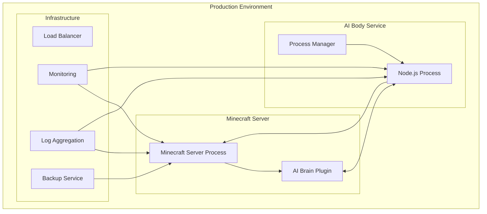

# Deployment Guide

This document provides comprehensive instructions for deploying the Minecraft AI Companion plugin in production environments.

## Table of Contents
- [Deployment Overview](#deployment-overview)
- [Production Requirements](#production-requirements)
- [Environment Configuration](#environment-configuration)
- [Server Setup](#server-setup)
- [Security Configuration](#security-configuration)
- [Monitoring and Logging](#monitoring-and-logging)
- [Backup and Recovery](#backup-and-recovery)
- [Troubleshooting](#troubleshooting)

## Deployment Overview

The Minecraft AI Companion consists of two main components that need to be deployed:

1. **AI Brain (Java Plugin)** - Deployed on the Minecraft server
2. **AI Body (Node.js Bot)** - Deployed as a separate process/service

### Architecture in Production



## Production Requirements

### Hardware Requirements

#### Minecraft Server
- **CPU**: 4+ cores (Intel i5/i7 or AMD equivalent)
- **RAM**: 8GB+ (4GB for server, 2GB for AI Brain, 2GB for system)
- **Storage**: 100GB+ SSD (for world data and backups)
- **Network**: Stable internet connection with low latency

#### AI Body Service
- **CPU**: 2+ cores
- **RAM**: 2GB+ (Node.js process can be memory-intensive)
- **Storage**: 10GB+ (for logs and temporary data)
- **Network**: Same network as Minecraft server for low latency

### Software Requirements

#### Minecraft Server
- **OS**: Linux (Ubuntu 20.04+ recommended) or Windows Server
- **Java**: OpenJDK 17+ or Oracle JDK 17+
- **Server Software**: Paper 1.21+ (recommended) or Spigot 1.21+

#### AI Body Service
- **OS**: Linux (Ubuntu 20.04+ recommended)
- **Node.js**: 18.x LTS or 20.x LTS
- **Process Manager**: PM2 (recommended) or systemd

## Environment Configuration

### Production Environment Variables

#### Minecraft Server Environment
```bash
# Java Options
JAVA_OPTS="-Xmx4G -Xms2G -XX:+UseG1GC -XX:+UnlockExperimentalVMOptions -XX:MaxGCPauseMillis=100 -XX:+DisableExplicitGC -XX:TargetSurvivorRatio=90 -XX:G1NewSizePercent=50 -XX:G1MaxNewSizePercent=80 -XX:G1MixedGCLiveThresholdPercent=35 -XX:+AlwaysPreTouch"

# AI Brain Plugin Configuration
AI_BRAIN_WEBSOCKET_HOST=0.0.0.0
AI_BRAIN_WEBSOCKET_PORT=8765
AI_BRAIN_LOG_LEVEL=INFO
AI_BRAIN_MAX_CONNECTIONS=10
```

#### AI Body Service Environment
```bash
# Node.js Configuration
NODE_ENV=production
NODE_OPTIONS="--max-old-space-size=1024"

# Minecraft Connection
MINECRAFT_HOST=localhost
MINECRAFT_PORT=25565
MINECRAFT_USERNAME=AICompanion

# WebSocket Configuration
WEBSOCKET_HOST=localhost
WEBSOCKET_PORT=8765
WEBSOCKET_RECONNECT_INTERVAL=5000
WEBSOCKET_MAX_RECONNECT_ATTEMPTS=10

# Logging
LOG_LEVEL=info
LOG_FILE=/var/log/minecraft-ai-body/bot.log

# Performance Tuning
MAX_MEMORY_USAGE=1024
GC_INTERVAL=60000
```

### Configuration Files

#### AI Brain Plugin Configuration (`config.yml`)
```yaml
# Production Configuration
websocket:
  host: "0.0.0.0"
  port: 8765
  ssl:
    enabled: false
    keystore: "path/to/keystore.jks"
    password: "keystore_password"
  
ai:
  default_personality: "friendly"
  response_timeout: 10000
  max_memory_usage: 512
  
bot:
  username: "AICompanion"
  auto_reconnect: true
  max_reconnect_attempts: 10
  reconnect_delay: 5000
  
features:
  combat_assistance: true
  building_assistant: true
  voice_integration: false
  
logging:
  level: "INFO"
  file: "logs/ai-brain.log"
  max_file_size: "10MB"
  max_files: 10
  
performance:
  update_interval: 20
  max_concurrent_operations: 5
  cache_size: 1000
  
security:
  allowed_hosts: ["localhost", "127.0.0.1"]
  max_connections: 10
  rate_limit: 100
```

#### AI Body Configuration (`.env.production`)
```env
# Production Environment
NODE_ENV=production
NODE_OPTIONS=--max-old-space-size=1024

# Minecraft Server
MINECRAFT_HOST=localhost
MINECRAFT_PORT=25565
MINECRAFT_USERNAME=AICompanion
MINECRAFT_PASSWORD=
MINECRAFT_AUTH=mojang

# WebSocket
WEBSOCKET_HOST=localhost
WEBSOCKET_PORT=8765
WEBSOCKET_SECURE=false
WEBSOCKET_RECONNECT_INTERVAL=5000
WEBSOCKET_MAX_RECONNECT_ATTEMPTS=10

# Performance
MAX_MEMORY_USAGE=1024
GC_INTERVAL=60000
PATHFINDER_TIMEOUT=10000
COMBAT_REACTION_TIME=100

# Logging
LOG_LEVEL=info
LOG_FILE=/var/log/minecraft-ai-body/bot.log
LOG_MAX_SIZE=10485760
LOG_MAX_FILES=10

# Health Check
HEALTH_CHECK_PORT=3000
HEALTH_CHECK_INTERVAL=30000
```

## Server Setup

### Minecraft Server Setup

#### 1. Install Dependencies
```bash
# Ubuntu/Debian
sudo apt update
sudo apt install openjdk-17-jdk screen wget

# CentOS/RHEL
sudo yum install java-17-openjdk screen wget
```

#### 2. Create Server User
```bash
sudo useradd -m -s /bin/bash minecraft
sudo mkdir -p /opt/minecraft
sudo chown minecraft:minecraft /opt/minecraft
```

#### 3. Download and Configure Server
```bash
sudo -u minecraft bash
cd /opt/minecraft

# Download Paper server
wget https://api.papermc.io/v2/projects/paper/versions/1.21/builds/latest/downloads/paper-1.21-latest.jar -O paper.jar

# Create start script
cat > start.sh << 'EOF'
#!/bin/bash
cd /opt/minecraft
java $JAVA_OPTS -jar paper.jar --nogui
EOF

chmod +x start.sh

# Accept EULA
echo "eula=true" > eula.txt

# Create systemd service
sudo tee /etc/systemd/system/minecraft.service > /dev/null << 'EOF'
[Unit]
Description=Minecraft Server
After=network.target

[Service]
Type=simple
User=minecraft
Group=minecraft
WorkingDirectory=/opt/minecraft
ExecStart=/opt/minecraft/start.sh
Restart=on-failure
RestartSec=10
Environment=JAVA_OPTS="-Xmx4G -Xms2G -XX:+UseG1GC"

[Install]
WantedBy=multi-user.target
EOF

sudo systemctl daemon-reload
sudo systemctl enable minecraft
```

#### 4. Deploy AI Brain Plugin
```bash
# Build the plugin
cd /path/to/minecraft-ai-plugin/minecraft-ai-brain
./gradlew build

# Copy to server
sudo cp build/libs/minecraft-ai-brain-*.jar /opt/minecraft/plugins/
sudo chown minecraft:minecraft /opt/minecraft/plugins/minecraft-ai-brain-*.jar
```

### AI Body Service Setup

#### 1. Install Node.js
```bash
# Using NodeSource repository
curl -fsSL https://deb.nodesource.com/setup_18.x | sudo -E bash -
sudo apt-get install -y nodejs

# Verify installation
node --version
npm --version
```

#### 2. Create Service User
```bash
sudo useradd -m -s /bin/bash aibot
sudo mkdir -p /opt/minecraft-ai-body
sudo chown aibot:aibot /opt/minecraft-ai-body
```

#### 3. Deploy AI Body Application
```bash
# Build the application
cd /path/to/minecraft-ai-plugin/minecraft-ai-body
npm ci --production
npm run build

# Copy to server
sudo cp -r dist/ package.json /opt/minecraft-ai-body/
sudo chown -R aibot:aibot /opt/minecraft-ai-body/

# Install production dependencies
sudo -u aibot bash
cd /opt/minecraft-ai-body
npm ci --production --omit=dev
```

#### 4. Install and Configure PM2
```bash
# Install PM2 globally
sudo npm install -g pm2

# Create PM2 ecosystem file
sudo -u aibot tee /opt/minecraft-ai-body/ecosystem.config.js > /dev/null << 'EOF'
module.exports = {
  apps: [{
    name: 'minecraft-ai-body',
    script: 'dist/index.js',
    cwd: '/opt/minecraft-ai-body',
    env: {
      NODE_ENV: 'production'
    },
    env_production: {
      NODE_ENV: 'production'
    },
    instances: 1,
    exec_mode: 'fork',
    max_memory_restart: '1G',
    restart_delay: 5000,
    max_restarts: 10,
    log_file: '/var/log/minecraft-ai-body/combined.log',
    out_file: '/var/log/minecraft-ai-body/out.log',
    error_file: '/var/log/minecraft-ai-body/error.log',
    time: true,
    watch: false,
    ignore_watch: ['node_modules', 'logs']
  }]
};
EOF

# Create log directory
sudo mkdir -p /var/log/minecraft-ai-body
sudo chown aibot:aibot /var/log/minecraft-ai-body

# Start application with PM2
sudo -u aibot pm2 start ecosystem.config.js --env production
sudo -u aibot pm2 save
sudo -u aibot pm2 startup
```

## Security Configuration

### Firewall Setup

#### 1. UFW (Ubuntu)
```bash
# Enable UFW
sudo ufw enable

# Allow SSH
sudo ufw allow 22/tcp

# Allow Minecraft server
sudo ufw allow 25565/tcp

# Allow WebSocket (restrict to internal network)
sudo ufw allow from 192.168.1.0/24 to any port 8765

# Allow HTTP/HTTPS for web interface (if applicable)
sudo ufw allow 80/tcp
sudo ufw allow 443/tcp

# Check status
sudo ufw status
```

#### 2. iptables (Alternative)
```bash
# Allow established connections
iptables -A INPUT -m state --state ESTABLISHED,RELATED -j ACCEPT

# Allow loopback
iptables -A INPUT -i lo -j ACCEPT

# Allow SSH
iptables -A INPUT -p tcp --dport 22 -j ACCEPT

# Allow Minecraft
iptables -A INPUT -p tcp --dport 25565 -j ACCEPT

# Allow WebSocket from internal network only
iptables -A INPUT -p tcp --dport 8765 -s 192.168.1.0/24 -j ACCEPT

# Default deny
iptables -A INPUT -j DROP
```

### SSL/TLS Configuration (Optional)

#### 1. Generate SSL Certificate
```bash
# Using Let's Encrypt
sudo apt install certbot
sudo certbot certonly --standalone -d your-domain.com

# Or generate self-signed certificate
sudo mkdir -p /etc/ssl/minecraft-ai
sudo openssl req -x509 -nodes -days 365 -newkey rsa:2048 \
  -keyout /etc/ssl/minecraft-ai/private.key \
  -out /etc/ssl/minecraft-ai/certificate.crt
```

#### 2. Configure SSL in AI Brain
```yaml
# config.yml
websocket:
  ssl:
    enabled: true
    keystore: "/etc/ssl/minecraft-ai/keystore.jks"
    password: "your_keystore_password"
```

### Access Control

#### 1. User Permissions
```bash
# Limit file permissions
sudo chmod 600 /opt/minecraft-ai-body/.env.production
sudo chmod 600 /opt/minecraft/plugins/minecraft-ai-brain/config.yml

# Set proper ownership
sudo chown minecraft:minecraft /opt/minecraft -R
sudo chown aibot:aibot /opt/minecraft-ai-body -R
```

#### 2. Network Security
```bash
# Configure fail2ban for SSH protection
sudo apt install fail2ban
sudo systemctl enable fail2ban
sudo systemctl start fail2ban

# Create fail2ban config for Minecraft
sudo tee /etc/fail2ban/jail.local > /dev/null << 'EOF'
[DEFAULT]
bantime = 3600
findtime = 600
maxretry = 5

[sshd]
enabled = true

[minecraft]
enabled = true
port = 25565
filter = minecraft
logpath = /opt/minecraft/logs/latest.log
maxretry = 3
bantime = 7200
EOF
```

## Monitoring and Logging

### Log Configuration

#### 1. Centralized Logging with rsyslog
```bash
# Configure rsyslog
sudo tee /etc/rsyslog.d/minecraft-ai.conf > /dev/null << 'EOF'
# Minecraft Server Logs
$FileCreateMode 0644
$DirCreateMode 0755
$Umask 0022

# AI Brain Plugin
if $programname == 'minecraft-ai-brain' then /var/log/minecraft-ai/brain.log
& stop

# AI Body Service
if $programname == 'minecraft-ai-body' then /var/log/minecraft-ai/body.log
& stop
EOF

sudo systemctl restart rsyslog
```

#### 2. Log Rotation
```bash
# Configure logrotate
sudo tee /etc/logrotate.d/minecraft-ai > /dev/null << 'EOF'
/var/log/minecraft-ai/*.log {
    daily
    rotate 7
    compress
    delaycompress
    missingok
    notifempty
    sharedscripts
    postrotate
        systemctl reload rsyslog
    endscript
}

/opt/minecraft/logs/*.log {
    daily
    rotate 30
    compress
    delaycompress
    missingok
    notifempty
    copytruncate
}
EOF
```

### Health Monitoring

#### 1. System Monitoring Script
```bash
#!/bin/bash
# /opt/minecraft-ai/monitor.sh

# Check Minecraft server
if ! systemctl is-active --quiet minecraft; then
    echo "$(date): Minecraft server is down, attempting restart" >> /var/log/minecraft-ai/monitor.log
    systemctl restart minecraft
fi

# Check AI Body service
if ! sudo -u aibot pm2 list | grep -q "minecraft-ai-body.*online"; then
    echo "$(date): AI Body service is down, attempting restart" >> /var/log/minecraft-ai/monitor.log
    sudo -u aibot pm2 restart minecraft-ai-body
fi

# Check WebSocket connectivity
if ! timeout 5 bash -c "</dev/tcp/localhost/8765"; then
    echo "$(date): WebSocket connection failed" >> /var/log/minecraft-ai/monitor.log
fi

# Check memory usage
MEMORY_USAGE=$(free | grep Mem | awk '{printf("%.2f"), $3/$2*100}')
if (( $(echo "$MEMORY_USAGE > 90" | bc -l) )); then
    echo "$(date): High memory usage: $MEMORY_USAGE%" >> /var/log/minecraft-ai/monitor.log
fi
```

#### 2. Setup Monitoring Cron Job
```bash
# Add to crontab
sudo crontab -e

# Add line:
*/5 * * * * /opt/minecraft-ai/monitor.sh
```

### Performance Monitoring

#### 1. Install Prometheus Node Exporter
```bash
# Download and install
cd /tmp
wget https://github.com/prometheus/node_exporter/releases/latest/download/node_exporter-*-linux-amd64.tar.gz
tar xzf node_exporter-*.tar.gz
sudo cp node_exporter-*/node_exporter /usr/local/bin/
sudo rm -rf node_exporter-*

# Create service
sudo tee /etc/systemd/system/node_exporter.service > /dev/null << 'EOF'
[Unit]
Description=Node Exporter
After=network.target

[Service]
Type=simple
User=prometheus
Group=prometheus
ExecStart=/usr/local/bin/node_exporter
Restart=on-failure

[Install]
WantedBy=multi-user.target
EOF

sudo systemctl daemon-reload
sudo systemctl enable node_exporter
sudo systemctl start node_exporter
```

## Backup and Recovery

### Automated Backup Script

```bash
#!/bin/bash
# /opt/minecraft-ai/backup.sh

BACKUP_DIR="/opt/backups/minecraft-ai"
DATE=$(date +%Y%m%d_%H%M%S)
RETENTION_DAYS=7

# Create backup directory
mkdir -p "$BACKUP_DIR"

# Backup Minecraft world
echo "Backing up Minecraft world..."
systemctl stop minecraft
tar -czf "$BACKUP_DIR/world_$DATE.tar.gz" -C /opt/minecraft world world_nether world_the_end
systemctl start minecraft

# Backup configurations
echo "Backing up configurations..."
tar -czf "$BACKUP_DIR/config_$DATE.tar.gz" \
  /opt/minecraft/server.properties \
  /opt/minecraft/plugins/minecraft-ai-brain/config.yml \
  /opt/minecraft-ai-body/.env.production \
  /opt/minecraft-ai-body/ecosystem.config.js

# Backup logs
echo "Backing up logs..."
tar -czf "$BACKUP_DIR/logs_$DATE.tar.gz" \
  /var/log/minecraft-ai \
  /opt/minecraft/logs

# Cleanup old backups
echo "Cleaning up old backups..."
find "$BACKUP_DIR" -name "*.tar.gz" -mtime +$RETENTION_DAYS -delete

echo "Backup completed: $DATE"
```

### Backup Cron Job

```bash
# Add to crontab
sudo crontab -e

# Add line for daily backup at 2 AM
0 2 * * * /opt/minecraft-ai/backup.sh >> /var/log/minecraft-ai/backup.log 2>&1
```

## Troubleshooting

### Common Issues

#### 1. WebSocket Connection Issues
```bash
# Check if port is open
sudo netstat -tlnp | grep 8765

# Check firewall
sudo ufw status
sudo iptables -L -n

# Test connection
telnet localhost 8765
```

#### 2. High Memory Usage
```bash
# Check memory usage
free -h
top -p $(pgrep -f minecraft)
sudo -u aibot pm2 monit

# Restart services if needed
systemctl restart minecraft
sudo -u aibot pm2 restart minecraft-ai-body
```

#### 3. Bot Connection Issues
```bash
# Check bot logs
sudo -u aibot pm2 logs minecraft-ai-body

# Check Minecraft server logs
tail -f /opt/minecraft/logs/latest.log

# Restart bot
sudo -u aibot pm2 restart minecraft-ai-body
```

### Emergency Recovery

#### 1. Service Recovery
```bash
# Stop all services
systemctl stop minecraft
sudo -u aibot pm2 stop minecraft-ai-body

# Restore from backup
cd /opt/backups/minecraft-ai
tar -xzf world_YYYYMMDD_HHMMSS.tar.gz -C /opt/minecraft/
tar -xzf config_YYYYMMDD_HHMMSS.tar.gz -C /

# Start services
systemctl start minecraft
sudo -u aibot pm2 start minecraft-ai-body
```

#### 2. Database Recovery (if applicable)
```bash
# Restore player data
cp /opt/backups/minecraft-ai/playerdata/* /opt/minecraft/world/playerdata/
chown minecraft:minecraft /opt/minecraft/world/playerdata/*
```

This deployment guide provides comprehensive instructions for setting up a production-ready Minecraft AI Companion system with proper security, monitoring, and backup procedures. 